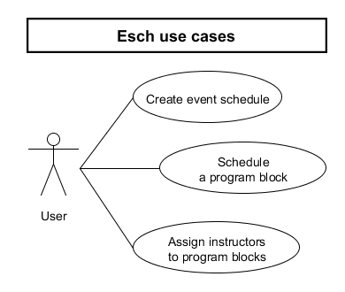
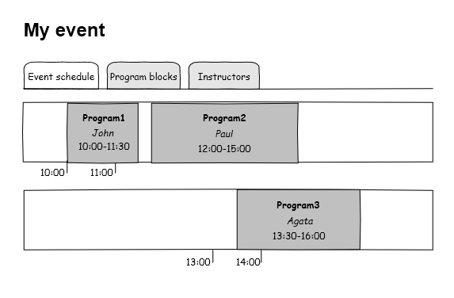
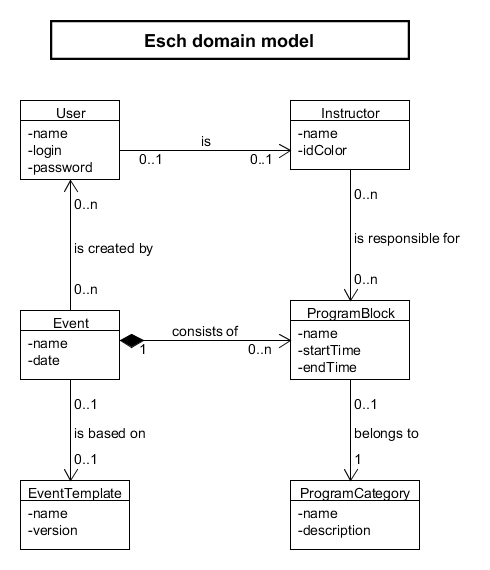
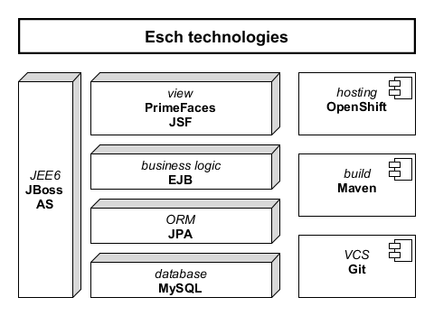

Esch
====

Esch (Event SCHeduler) bude aplikace pro plánování událostí a akcí. Umožní rychle 
vytvořit a snadno spravovat harmonogram akce.

Hlavním případem užití je vytváření programových bloků a jejich umisťování do 
harmonogramu. Jeho vzhled je načrtnutý na následujícím obrázku.

Základními entitami jsou Uživatel, Událost a Programový blok. Uživatel může být 
zároveň Instruktorem, který je za daný Program zodpovědný.

Webová aplikace bude postavena převážně na technologiích společnosti Red Hat.

